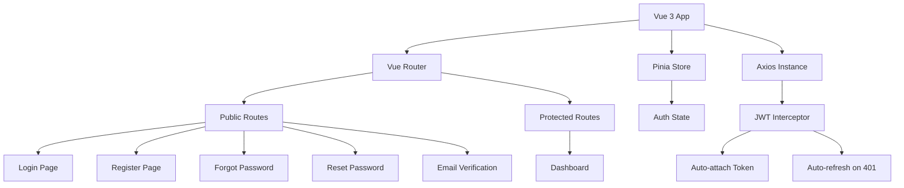

# Vue 3 Frontend — Production Auth System

A step-by-step guide to build a stunning authentication frontend with Vue 3 + Vite.  
**You type everything manually** — every block is explained.

---

## Architecture Overview



### What We're Building

| Feature | Implementation |
|---|---|
| State Management | Pinia store for auth state |
| HTTP Client | Axios with JWT interceptors |
| Routing | Vue Router with navigation guards |
| Token Refresh | Automatic silent refresh on 401 |
| Form Validation | Real-time client-side validation |
| Theme | Dark/Light mode with system detection |
| Notifications | Toast system for feedback |
| Responsive | Mobile-first CSS design |

---

## Phase 1: Project Setup

### Step 1.1 — Create the Vue Project

Open a **new terminal** (keep your Django server running in the other one). Navigate to your project root:

```bash
cd c:\Users\aadit\Desktop\Django_Authentication
npm create vite@latest frontend -- --template vue
```

**What this does:**
- `npm create vite@latest` — Uses Vite as the build tool (blazing fast, instant HMR)
- `frontend` — Creates the project in a `frontend/` subdirectory
- `--template vue` — Sets up Vue 3 with SFC (Single File Components)

Then:

```bash
cd frontend
npm install
```

### Step 1.2 — Install Dependencies

```bash
npm install vue-router@4 pinia axios
```

| Package | Purpose |
|---|---|
| `vue-router@4` | Client-side routing (page navigation without reload) |
| `pinia` | State management (Vue's official replacement for Vuex) |
| `axios` | HTTP client for API calls (better than fetch — interceptors, auto-JSON, etc.) |

### Step 1.3 — Project Structure

Create these folders and files inside `frontend/src/`:

```
frontend/src/
├── assets/
│   └── main.css              ← Global styles + design system
├── components/
│   ├── AppToast.vue          ← Toast notification component
│   ├── ThemeToggle.vue       ← Dark/Light mode switch
│   └── AuthLayout.vue        ← Shared layout for auth pages
├── composables/
│   └── useToast.js           ← Toast notification logic (reusable)
├── router/
│   └── index.js              ← Vue Router config + guards
├── services/
│   └── api.js                ← Axios instance + JWT interceptors
├── stores/
│   └── auth.js               ← Pinia auth store
├── views/
│   ├── LoginView.vue
│   ├── RegisterView.vue
│   ├── ForgotPasswordView.vue
│   ├── ResetPasswordView.vue
│   ├── VerifyEmailView.vue
│   └── DashboardView.vue
├── App.vue
└── main.js
```

Create all the empty folders now. The files we'll build one by one.

**Why this structure?**
- `components/` — Reusable UI pieces (used across multiple pages)
- `composables/` — Reusable logic (Vue 3's version of React hooks)
- `services/` — API/external service communication
- `stores/` — Pinia state stores
- `views/` — Page-level components (one per route)

---

## Phase 2: Design System (CSS)

### Step 2.1 — Create `src/assets/main.css`

Replace whatever is in `src/assets/main.css` (or `src/style.css`) with this. Delete `src/style.css` if it exists.

```css
/* ═══════════════════════════════════════════════════════════════
   DESIGN SYSTEM — Production Auth UI
   ═══════════════════════════════════════════════════════════════ */

/* ─── Google Font ──────────────────────────────────────────── */
@import url('https://fonts.googleapis.com/css2?family=Inter:wght@300;400;500;600;700;800&display=swap');

/* ─── CSS Custom Properties (Design Tokens) ────────────────── */
:root {
  /* Colors — Light Mode */
  --color-bg-primary: #f8f9fc;
  --color-bg-secondary: #ffffff;
  --color-bg-tertiary: #f1f3f9;
  --color-bg-glass: rgba(255, 255, 255, 0.7);

  --color-text-primary: #1a1d2e;
  --color-text-secondary: #6b7194;
  --color-text-tertiary: #9da3c0;

  --color-border: #e2e5f1;
  --color-border-focus: #6366f1;

  --color-accent: #6366f1;
  --color-accent-hover: #5558e6;
  --color-accent-light: rgba(99, 102, 241, 0.1);
  --color-accent-glow: rgba(99, 102, 241, 0.25);

  --color-success: #22c55e;
  --color-success-light: rgba(34, 197, 94, 0.1);
  --color-error: #ef4444;
  --color-error-light: rgba(239, 68, 68, 0.1);
  --color-warning: #f59e0b;
  --color-warning-light: rgba(245, 158, 11, 0.1);

  /* Shadows */
  --shadow-sm: 0 1px 2px rgba(0, 0, 0, 0.04);
  --shadow-md: 0 4px 12px rgba(0, 0, 0, 0.06);
  --shadow-lg: 0 8px 30px rgba(0, 0, 0, 0.08);
  --shadow-xl: 0 20px 60px rgba(0, 0, 0, 0.1);
  --shadow-glow: 0 0 20px var(--color-accent-glow);

  /* Radius */
  --radius-sm: 8px;
  --radius-md: 12px;
  --radius-lg: 16px;
  --radius-xl: 24px;
  --radius-full: 9999px;

  /* Transitions */
  --transition-fast: 150ms cubic-bezier(0.4, 0, 0.2, 1);
  --transition-base: 250ms cubic-bezier(0.4, 0, 0.2, 1);
  --transition-slow: 400ms cubic-bezier(0.4, 0, 0.2, 1);

  /* Font */
  --font-family: 'Inter', -apple-system, BlinkMacSystemFont, sans-serif;
}

/* ─── Dark Mode ─────────────────────────────────────────────── */
[data-theme="dark"] {
  --color-bg-primary: #0f1117;
  --color-bg-secondary: #1a1d2e;
  --color-bg-tertiary: #252840;
  --color-bg-glass: rgba(26, 29, 46, 0.8);

  --color-text-primary: #e8eaf0;
  --color-text-secondary: #9da3c0;
  --color-text-tertiary: #6b7194;

  --color-border: #2d3154;
  --color-border-focus: #818cf8;

  --color-accent: #818cf8;
  --color-accent-hover: #6366f1;
  --color-accent-light: rgba(129, 140, 248, 0.1);
  --color-accent-glow: rgba(129, 140, 248, 0.2);

  --shadow-sm: 0 1px 2px rgba(0, 0, 0, 0.2);
  --shadow-md: 0 4px 12px rgba(0, 0, 0, 0.3);
  --shadow-lg: 0 8px 30px rgba(0, 0, 0, 0.4);
  --shadow-xl: 0 20px 60px rgba(0, 0, 0, 0.5);
}

/* ─── Reset & Base ──────────────────────────────────────────── */
*,
*::before,
*::after {
  box-sizing: border-box;
  margin: 0;
  padding: 0;
}

html {
  font-size: 16px;
  -webkit-font-smoothing: antialiased;
  -moz-osx-font-smoothing: grayscale;
}

body {
  font-family: var(--font-family);
  background-color: var(--color-bg-primary);
  color: var(--color-text-primary);
  line-height: 1.6;
  transition: background-color var(--transition-base), color var(--transition-base);
}

a {
  color: var(--color-accent);
  text-decoration: none;
  transition: color var(--transition-fast);
}

a:hover {
  color: var(--color-accent-hover);
}

/* ─── Auth Layout ───────────────────────────────────────────── */
.auth-page {
  min-height: 100vh;
  display: flex;
  align-items: center;
  justify-content: center;
  padding: 2rem;
  position: relative;
  overflow: hidden;
}

.auth-page::before {
  content: '';
  position: absolute;
  top: -50%;
  left: -50%;
  width: 200%;
  height: 200%;
  background: radial-gradient(
    circle at 30% 40%,
    var(--color-accent-light) 0%,
    transparent 50%
  ),
  radial-gradient(
    circle at 70% 60%,
    rgba(139, 92, 246, 0.06) 0%,
    transparent 50%
  );
  animation: bgShift 20s ease-in-out infinite alternate;
  pointer-events: none;
}

@keyframes bgShift {
  0% { transform: translate(0, 0) rotate(0deg); }
  100% { transform: translate(-3%, -3%) rotate(3deg); }
}

.auth-card {
  width: 100%;
  max-width: 440px;
  background: var(--color-bg-secondary);
  border: 1px solid var(--color-border);
  border-radius: var(--radius-xl);
  padding: 2.5rem;
  box-shadow: var(--shadow-xl);
  position: relative;
  z-index: 1;
  animation: cardEnter 0.5s cubic-bezier(0.22, 1, 0.36, 1);
}

@keyframes cardEnter {
  from {
    opacity: 0;
    transform: translateY(16px) scale(0.98);
  }
  to {
    opacity: 1;
    transform: translateY(0) scale(1);
  }
}

.auth-header {
  text-align: center;
  margin-bottom: 2rem;
}

.auth-logo {
  width: 48px;
  height: 48px;
  background: linear-gradient(135deg, var(--color-accent), #a855f7);
  border-radius: var(--radius-md);
  display: flex;
  align-items: center;
  justify-content: center;
  margin: 0 auto 1rem;
  font-size: 1.5rem;
  color: white;
  box-shadow: var(--shadow-glow);
}

.auth-title {
  font-size: 1.5rem;
  font-weight: 700;
  color: var(--color-text-primary);
  margin-bottom: 0.375rem;
}

.auth-subtitle {
  font-size: 0.875rem;
  color: var(--color-text-secondary);
}

/* ─── Form Elements ─────────────────────────────────────────── */
.form-group {
  margin-bottom: 1.25rem;
}

.form-label {
  display: block;
  font-size: 0.8125rem;
  font-weight: 600;
  color: var(--color-text-primary);
  margin-bottom: 0.375rem;
  letter-spacing: 0.01em;
}

.form-input-wrapper {
  position: relative;
}

.form-input {
  width: 100%;
  padding: 0.75rem 1rem;
  padding-left: 2.75rem;
  background: var(--color-bg-tertiary);
  border: 1.5px solid var(--color-border);
  border-radius: var(--radius-md);
  color: var(--color-text-primary);
  font-family: var(--font-family);
  font-size: 0.875rem;
  transition: all var(--transition-fast);
  outline: none;
}

.form-input::placeholder {
  color: var(--color-text-tertiary);
}

.form-input:focus {
  border-color: var(--color-border-focus);
  box-shadow: 0 0 0 3px var(--color-accent-light);
  background: var(--color-bg-secondary);
}

.form-input.error {
  border-color: var(--color-error);
  box-shadow: 0 0 0 3px var(--color-error-light);
}

.form-input-icon {
  position: absolute;
  left: 0.875rem;
  top: 50%;
  transform: translateY(-50%);
  color: var(--color-text-tertiary);
  font-size: 1rem;
  pointer-events: none;
  transition: color var(--transition-fast);
}

.form-input:focus ~ .form-input-icon,
.form-input:focus + .form-input-icon {
  color: var(--color-accent);
}

.form-error {
  font-size: 0.75rem;
  color: var(--color-error);
  margin-top: 0.375rem;
  display: flex;
  align-items: center;
  gap: 0.25rem;
  animation: errorShake 0.3s ease;
}

@keyframes errorShake {
  0%, 100% { transform: translateX(0); }
  25% { transform: translateX(-4px); }
  75% { transform: translateX(4px); }
}

.password-toggle {
  position: absolute;
  right: 0.875rem;
  top: 50%;
  transform: translateY(-50%);
  background: none;
  border: none;
  color: var(--color-text-tertiary);
  cursor: pointer;
  font-size: 1rem;
  padding: 0.25rem;
  transition: color var(--transition-fast);
}

.password-toggle:hover {
  color: var(--color-text-primary);
}

/* ─── Buttons ───────────────────────────────────────────────── */
.btn {
  display: inline-flex;
  align-items: center;
  justify-content: center;
  gap: 0.5rem;
  padding: 0.75rem 1.5rem;
  border: none;
  border-radius: var(--radius-md);
  font-family: var(--font-family);
  font-size: 0.875rem;
  font-weight: 600;
  cursor: pointer;
  transition: all var(--transition-fast);
  outline: none;
  position: relative;
  overflow: hidden;
}

.btn-primary {
  width: 100%;
  background: linear-gradient(135deg, var(--color-accent), #8b5cf6);
  color: white;
  box-shadow: var(--shadow-md), 0 0 20px var(--color-accent-glow);
}

.btn-primary:hover:not(:disabled) {
  transform: translateY(-1px);
  box-shadow: var(--shadow-lg), 0 0 30px var(--color-accent-glow);
}

.btn-primary:active:not(:disabled) {
  transform: translateY(0);
}

.btn-primary:disabled {
  opacity: 0.6;
  cursor: not-allowed;
}

.btn-secondary {
  background: var(--color-bg-tertiary);
  color: var(--color-text-primary);
  border: 1.5px solid var(--color-border);
}

.btn-secondary:hover {
  background: var(--color-border);
}

/* ─── Loading Spinner ───────────────────────────────────────── */
.spinner {
  width: 18px;
  height: 18px;
  border: 2px solid rgba(255, 255, 255, 0.3);
  border-top-color: white;
  border-radius: 50%;
  animation: spin 0.6s linear infinite;
}

@keyframes spin {
  to { transform: rotate(360deg); }
}

/* ─── Password Strength Meter ───────────────────────────────── */
.password-strength {
  margin-top: 0.5rem;
}

.strength-bar {
  height: 4px;
  background: var(--color-bg-tertiary);
  border-radius: var(--radius-full);
  overflow: hidden;
  margin-bottom: 0.375rem;
}

.strength-fill {
  height: 100%;
  border-radius: var(--radius-full);
  transition: width var(--transition-base), background-color var(--transition-base);
}

.strength-fill.weak { width: 25%; background: var(--color-error); }
.strength-fill.fair { width: 50%; background: var(--color-warning); }
.strength-fill.good { width: 75%; background: #3b82f6; }
.strength-fill.strong { width: 100%; background: var(--color-success); }

.strength-text {
  font-size: 0.6875rem;
  font-weight: 500;
}

.strength-text.weak { color: var(--color-error); }
.strength-text.fair { color: var(--color-warning); }
.strength-text.good { color: #3b82f6; }
.strength-text.strong { color: var(--color-success); }

/* ─── Toast Notifications ───────────────────────────────────── */
.toast-container {
  position: fixed;
  top: 1.5rem;
  right: 1.5rem;
  z-index: 9999;
  display: flex;
  flex-direction: column;
  gap: 0.75rem;
}

.toast {
  display: flex;
  align-items: center;
  gap: 0.75rem;
  padding: 0.875rem 1.25rem;
  border-radius: var(--radius-md);
  background: var(--color-bg-secondary);
  border: 1px solid var(--color-border);
  box-shadow: var(--shadow-lg);
  font-size: 0.8125rem;
  font-weight: 500;
  color: var(--color-text-primary);
  min-width: 280px;
  max-width: 400px;
  animation: toastIn 0.4s cubic-bezier(0.22, 1, 0.36, 1);
}

.toast.leaving {
  animation: toastOut 0.3s cubic-bezier(0.4, 0, 1, 1) forwards;
}

.toast-success { border-left: 3px solid var(--color-success); }
.toast-error { border-left: 3px solid var(--color-error); }
.toast-warning { border-left: 3px solid var(--color-warning); }
.toast-info { border-left: 3px solid var(--color-accent); }

.toast-icon {
  font-size: 1.125rem;
  flex-shrink: 0;
}

.toast-success .toast-icon { color: var(--color-success); }
.toast-error .toast-icon { color: var(--color-error); }
.toast-warning .toast-icon { color: var(--color-warning); }
.toast-info .toast-icon { color: var(--color-accent); }

.toast-close {
  margin-left: auto;
  background: none;
  border: none;
  color: var(--color-text-tertiary);
  cursor: pointer;
  font-size: 1rem;
  padding: 0.25rem;
  transition: color var(--transition-fast);
}

.toast-close:hover {
  color: var(--color-text-primary);
}

@keyframes toastIn {
  from { opacity: 0; transform: translateX(100%); }
  to { opacity: 1; transform: translateX(0); }
}

@keyframes toastOut {
  from { opacity: 1; transform: translateX(0); }
  to { opacity: 0; transform: translateX(100%); }
}

/* ─── Dashboard ─────────────────────────────────────────────── */
.dashboard {
  min-height: 100vh;
  background: var(--color-bg-primary);
}

.dashboard-nav {
  display: flex;
  align-items: center;
  justify-content: space-between;
  padding: 1rem 2rem;
  background: var(--color-bg-secondary);
  border-bottom: 1px solid var(--color-border);
  box-shadow: var(--shadow-sm);
}

.nav-brand {
  display: flex;
  align-items: center;
  gap: 0.75rem;
  font-weight: 700;
  font-size: 1.125rem;
  color: var(--color-text-primary);
}

.nav-brand-icon {
  width: 32px;
  height: 32px;
  background: linear-gradient(135deg, var(--color-accent), #a855f7);
  border-radius: var(--radius-sm);
  display: flex;
  align-items: center;
  justify-content: center;
  color: white;
  font-size: 0.875rem;
}

.nav-actions {
  display: flex;
  align-items: center;
  gap: 1rem;
}

.dashboard-content {
  max-width: 800px;
  margin: 2rem auto;
  padding: 0 2rem;
}

.profile-card {
  background: var(--color-bg-secondary);
  border: 1px solid var(--color-border);
  border-radius: var(--radius-lg);
  padding: 2rem;
  box-shadow: var(--shadow-md);
}

.profile-avatar {
  width: 72px;
  height: 72px;
  border-radius: 50%;
  background: linear-gradient(135deg, var(--color-accent), #a855f7);
  display: flex;
  align-items: center;
  justify-content: center;
  color: white;
  font-size: 1.75rem;
  font-weight: 700;
  margin-bottom: 1.25rem;
}

.profile-name {
  font-size: 1.375rem;
  font-weight: 700;
  color: var(--color-text-primary);
  margin-bottom: 0.25rem;
}

.profile-email {
  font-size: 0.875rem;
  color: var(--color-text-secondary);
  margin-bottom: 1.5rem;
}

.profile-badge {
  display: inline-flex;
  align-items: center;
  gap: 0.375rem;
  padding: 0.375rem 0.75rem;
  border-radius: var(--radius-full);
  font-size: 0.75rem;
  font-weight: 600;
}

.badge-verified {
  background: var(--color-success-light);
  color: var(--color-success);
}

.badge-unverified {
  background: var(--color-warning-light);
  color: var(--color-warning);
}

.profile-details {
  margin-top: 1.5rem;
  padding-top: 1.5rem;
  border-top: 1px solid var(--color-border);
}

.detail-row {
  display: flex;
  justify-content: space-between;
  align-items: center;
  padding: 0.75rem 0;
}

.detail-row:not(:last-child) {
  border-bottom: 1px solid var(--color-border);
}

.detail-label {
  font-size: 0.8125rem;
  color: var(--color-text-secondary);
  font-weight: 500;
}

.detail-value {
  font-size: 0.875rem;
  color: var(--color-text-primary);
  font-weight: 600;
}

/* ─── Theme Toggle ──────────────────────────────────────────── */
.theme-toggle {
  width: 40px;
  height: 40px;
  border-radius: var(--radius-sm);
  border: 1px solid var(--color-border);
  background: var(--color-bg-tertiary);
  color: var(--color-text-secondary);
  cursor: pointer;
  display: flex;
  align-items: center;
  justify-content: center;
  font-size: 1.125rem;
  transition: all var(--transition-fast);
}

.theme-toggle:hover {
  background: var(--color-border);
  color: var(--color-text-primary);
}

/* ─── Auth Footer Links ─────────────────────────────────────── */
.auth-footer {
  text-align: center;
  margin-top: 1.5rem;
  font-size: 0.8125rem;
  color: var(--color-text-secondary);
}

.auth-footer a {
  font-weight: 600;
}

.auth-divider {
  display: flex;
  align-items: center;
  gap: 1rem;
  margin: 1.5rem 0;
  color: var(--color-text-tertiary);
  font-size: 0.75rem;
  font-weight: 500;
  text-transform: uppercase;
  letter-spacing: 0.05em;
}

.auth-divider::before,
.auth-divider::after {
  content: '';
  flex: 1;
  height: 1px;
  background: var(--color-border);
}

/* ─── Responsive ────────────────────────────────────────────── */
@media (max-width: 480px) {
  .auth-card {
    padding: 1.75rem;
    border-radius: var(--radius-lg);
  }

  .auth-page {
    padding: 1rem;
  }

  .toast-container {
    top: 1rem;
    right: 1rem;
    left: 1rem;
  }

  .toast {
    min-width: auto;
  }

  .dashboard-nav {
    padding: 0.75rem 1rem;
  }

  .dashboard-content {
    padding: 0 1rem;
  }
}

/* ─── Utilities ─────────────────────────────────────────────── */
.text-center { text-align: center; }
.mt-1 { margin-top: 0.5rem; }
.mt-2 { margin-top: 1rem; }
.mb-1 { margin-bottom: 0.5rem; }
.mb-2 { margin-bottom: 1rem; }
```

**Why CSS Custom Properties (variables)?**

This is a **design token system**. Every color, shadow, radius, and transition is defined once and referenced everywhere. When you switch themes (dark mode), you only change the variable values — every component updates automatically. This is how design systems work at companies like GitHub, Linear, and Vercel.

**Key design decisions:**
- **Inter font** — Used by GitHub, Linear, Vercel. Clean, highly legible, designed for screens.
- **Indigo/violet accent** (`#6366f1`) — Modern, not generic blue. Same family as Tailwind's indigo.
- **Glassmorphism on auth page** — The subtle `::before` gradient creates depth without being distracting.
- **`cubic-bezier(0.22, 1, 0.36, 1)`** — Custom easing curve that feels snappy but smooth (used by Apple).
- **Error shake animation** — Immediate visual feedback that something's wrong.

---

## Phase 3: Axios + JWT Interceptors

### Step 3.1 — Create `src/services/api.js`

This is the **most critical file** for auth. It handles all API communication and token management.

```javascript
/**
 * Axios instance with JWT interceptor.
 * - Automatically attaches access token to every request.
 * - Automatically refreshes token on 401 and retries the failed request.
 * - Redirects to login if refresh token is also expired.
 */
import axios from 'axios'

// Create a dedicated axios instance (don't pollute the global axios)
const api = axios.create({
  baseURL: 'http://localhost:8000/api/auth',
  headers: {
    'Content-Type': 'application/json',
  },
})

/**
 * REQUEST INTERCEPTOR
 * Runs before every request is sent.
 * Attaches the JWT access token from localStorage.
 */
api.interceptors.request.use(
  (config) => {
    const token = localStorage.getItem('access_token')
    if (token) {
      config.headers.Authorization = `Bearer ${token}`
    }
    return config
  },
  (error) => {
    return Promise.reject(error)
  }
)

/**
 * RESPONSE INTERCEPTOR
 * Runs after every response is received.
 * If a 401 (Unauthorized) comes back, it tries to refresh the token
 * using the refresh token. If refresh works, it retries the original
 * request. If refresh also fails, it clears tokens and redirects to login.
 */

// Flag to prevent multiple simultaneous refresh attempts
let isRefreshing = false
// Queue of requests that came in while we were refreshing
let failedQueue = []

/**
 * Process the queue of failed requests after refresh succeeds or fails.
 * If refresh succeeded, retry all queued requests with the new token.
 * If refresh failed, reject all queued requests.
 */
const processQueue = (error, token = null) => {
  failedQueue.forEach(({ resolve, reject }) => {
    if (error) {
      reject(error)
    } else {
      resolve(token)
    }
  })
  failedQueue = []
}

api.interceptors.response.use(
  // Success — just pass through
  (response) => response,

  // Error handler
  async (error) => {
    const originalRequest = error.config

    // Only handle 401 errors (unauthorized / token expired)
    // _retry flag prevents infinite loops
    if (error.response?.status === 401 && !originalRequest._retry) {
      // If we're already refreshing, queue this request
      if (isRefreshing) {
        return new Promise((resolve, reject) => {
          failedQueue.push({ resolve, reject })
        }).then((token) => {
          originalRequest.headers.Authorization = `Bearer ${token}`
          return api(originalRequest)
        })
      }

      originalRequest._retry = true
      isRefreshing = true

      const refreshToken = localStorage.getItem('refresh_token')

      if (!refreshToken) {
        // No refresh token — user must log in again
        localStorage.removeItem('access_token')
        localStorage.removeItem('refresh_token')
        window.location.href = '/login'
        return Promise.reject(error)
      }

      try {
        // Call the refresh endpoint
        const response = await axios.post(
          'http://localhost:8000/api/auth/token/refresh/',
          { refresh: refreshToken }
        )

        const { access, refresh } = response.data

        // Store new tokens
        localStorage.setItem('access_token', access)
        // If server rotates refresh tokens, store the new one
        if (refresh) {
          localStorage.setItem('refresh_token', refresh)
        }

        // Update the failed request's auth header
        originalRequest.headers.Authorization = `Bearer ${access}`

        // Process all queued requests with the new token
        processQueue(null, access)

        // Retry the original request
        return api(originalRequest)
      } catch (refreshError) {
        // Refresh failed — tokens are fully expired
        processQueue(refreshError, null)
        localStorage.removeItem('access_token')
        localStorage.removeItem('refresh_token')
        window.location.href = '/login'
        return Promise.reject(refreshError)
      } finally {
        isRefreshing = false
      }
    }

    return Promise.reject(error)
  }
)

export default api
```

**Why is this so important?**

This is the pattern used in production apps at companies like Spotify, Notion, and Linear. Here's what happens in a real user session:

1. User logs in → gets `access_token` (15 min) + `refresh_token` (7 days)
2. User browses the app. Every API call includes `Bearer <access_token>` in the header.
3. After 15 minutes, the access token expires.
4. The next API call returns `401 Unauthorized`.
5. **The interceptor catches it**, calls `/token/refresh/` with the refresh token.
6. Gets a new access token, retries the failed request **automatically**.
7. The user never notices anything happened. No login popup. No interrupted workflow.

**The queue pattern:**
If 5 API calls happen simultaneously and all get 401, you don't want 5 separate refresh requests. The `isRefreshing` flag + `failedQueue` ensures only ONE refresh happens, and all 5 requests get retried with the new token.

**Why `axios.post` instead of `api.post` for the refresh call?**
If we used `api.post`, the interceptor would attach the expired access token to the refresh request. Using plain `axios` avoids the interceptor entirely.

---

## Phase 4: Toast Notification System

### Step 4.1 — Create `src/composables/useToast.js`

```javascript
/**
 * Toast notification composable.
 * Provides reactive toast state and methods to show/dismiss toasts.
 * Works like React's custom hooks — reusable across components.
 */
import { reactive } from 'vue'

// Shared state — any component importing this gets the same state
const toasts = reactive([])
let toastId = 0

/**
 * Show a toast notification.
 * @param {string} message - The message to display
 * @param {'success'|'error'|'warning'|'info'} type - Toast type
 * @param {number} duration - Auto-dismiss time in ms (default: 4000)
 */
function showToast(message, type = 'info', duration = 4000) {
  const id = ++toastId

  toasts.push({ id, message, type, leaving: false })

  // Auto-dismiss after duration
  setTimeout(() => {
    dismissToast(id)
  }, duration)
}

/**
 * Dismiss a toast with exit animation.
 * Sets 'leaving' flag first for CSS animation, then removes after 300ms.
 */
function dismissToast(id) {
  const toast = toasts.find((t) => t.id === id)
  if (toast) {
    toast.leaving = true
    setTimeout(() => {
      const index = toasts.findIndex((t) => t.id === id)
      if (index > -1) {
        toasts.splice(index, 1)
      }
    }, 300) // matches CSS animation duration
  }
}

export function useToast() {
  return {
    toasts,
    showToast,
    dismissToast,
  }
}
```

**Why a composable instead of a component?**

In Vue 3, composables (the `use___()` pattern) let you share **reactive state + logic** across components without prop drilling. This is like React's `useContext` + custom hooks combined.

The `toasts` array is `reactive()` — when we push/remove from it, any component rendering it automatically re-renders. Since we define it outside the function, it's a **singleton** — all components share the same toast queue.

### Step 4.2 — Create `src/components/AppToast.vue`

```vue
<!--
  Toast notification container.
  Renders all active toasts from the composable.
  Place this once in App.vue — it works globally.
-->
<template>
  <div class="toast-container">
    <div
      v-for="toast in toasts"
      :key="toast.id"
      :class="['toast', `toast-${toast.type}`, { leaving: toast.leaving }]"
    >
      <span class="toast-icon">
        {{ toast.type === 'success' ? '✓' : toast.type === 'error' ? '✕' : toast.type === 'warning' ? '⚠' : 'ℹ' }}
      </span>
      <span>{{ toast.message }}</span>
      <button class="toast-close" @click="dismissToast(toast.id)">×</button>
    </div>
  </div>
</template>

<script setup>
import { useToast } from '../composables/useToast'

const { toasts, dismissToast } = useToast()
</script>
```

**Vue SFC explained:**
- `<template>` — The HTML (what renders). Like React's JSX return.
- `<script setup>` — JavaScript logic. The `setup` attribute is Vue 3's Composition API shorthand — everything you declare here is automatically available in the template. No `export default`, no `data()`, no `methods` boilerplate.
- `v-for` — Vue's loop directive (like `{items.map()}` in React)
- `v-bind:class` (shorthand `:class`) — Dynamic CSS classes. Array syntax lets you combine static and dynamic classes.

---

## Phase 5: Theme Toggle

### Step 5.1 — Create `src/components/ThemeToggle.vue`

```vue
<!--
  Dark/Light mode toggle button.
  Detects system preference on mount.
  Persists choice in localStorage.
-->
<template>
  <button class="theme-toggle" @click="toggleTheme" :title="isDark ? 'Switch to light mode' : 'Switch to dark mode'">
    {{ isDark ? '☀️' : '🌙' }}
  </button>
</template>

<script setup>
import { ref, onMounted } from 'vue'

const isDark = ref(false)

function toggleTheme() {
  isDark.value = !isDark.value
  applyTheme()
}

function applyTheme() {
  document.documentElement.setAttribute('data-theme', isDark.value ? 'dark' : 'light')
  localStorage.setItem('theme', isDark.value ? 'dark' : 'light')
}

onMounted(() => {
  // Check localStorage first, then system preference
  const saved = localStorage.getItem('theme')
  if (saved) {
    isDark.value = saved === 'dark'
  } else {
    // matchMedia detects the OS-level dark mode setting
    isDark.value = window.matchMedia('(prefers-color-scheme: dark)').matches
  }
  applyTheme()
})
</script>
```

**Key Vue 3 concepts:**
- `ref(false)` — Creates a reactive variable. In the `<script>`, you access it as `isDark.value`. In the `<template>`, Vue auto-unwraps it so you just write `isDark`.
- `onMounted()` — Lifecycle hook. Runs after the component is inserted into the DOM. Like React's `useEffect(() => {}, [])`.
- `@click` — Event binding (shorthand for `v-on:click`). Like React's `onClick`.

---

## Phase 6: Pinia Auth Store

### Step 6.1 — Create `src/stores/auth.js`

```javascript
/**
 * Pinia auth store.
 * Centralizes all authentication state and actions.
 * Components read state from here; never manage tokens directly.
 */
import { defineStore } from 'pinia'
import { ref, computed } from 'vue'
import api from '../services/api'
import { useToast } from '../composables/useToast'

export const useAuthStore = defineStore('auth', () => {
  // ─── State ──────────────────────────────────────────────────
  const user = ref(null)
  const isLoading = ref(false)
  const isInitialized = ref(false)

  // ─── Getters (computed) ─────────────────────────────────────
  const isAuthenticated = computed(() => !!user.value)
  const userInitials = computed(() => {
    if (!user.value) return '?'
    const first = user.value.first_name?.[0] || ''
    const last = user.value.last_name?.[0] || ''
    return (first + last).toUpperCase() || user.value.email[0].toUpperCase()
  })

  // ─── Toast ──────────────────────────────────────────────────
  const { showToast } = useToast()

  // ─── Actions ────────────────────────────────────────────────

  /**
   * Initialize auth state on app load.
   * Checks if tokens exist in localStorage and fetches user profile.
   */
  async function initAuth() {
    const accessToken = localStorage.getItem('access_token')
    if (accessToken) {
      try {
        await fetchProfile()
      } catch {
        // Token is invalid/expired — interceptor will handle refresh
        // If refresh also fails, interceptor redirects to login
      }
    }
    isInitialized.value = true
  }

  /**
   * Register a new user.
   * Stores tokens and user data on success.
   */
  async function register(userData) {
    isLoading.value = true
    try {
      const response = await api.post('/register/', userData)
      const { tokens, user: userData2 } = response.data

      localStorage.setItem('access_token', tokens.access)
      localStorage.setItem('refresh_token', tokens.refresh)
      user.value = userData2

      showToast('Account created successfully! Check your email to verify.', 'success')
      return { success: true }
    } catch (error) {
      const errors = error.response?.data
      let message = 'Registration failed. Please try again.'

      if (errors) {
        // Extract first error message from DRF's error format
        const firstKey = Object.keys(errors)[0]
        const firstError = Array.isArray(errors[firstKey]) ? errors[firstKey][0] : errors[firstKey]
        if (typeof firstError === 'string') message = firstError
      }

      showToast(message, 'error')
      return { success: false, errors: errors }
    } finally {
      isLoading.value = false
    }
  }

  /**
   * Log in with email and password.
   * Stores tokens and user data on success.
   */
  async function login(credentials) {
    isLoading.value = true
    try {
      const response = await api.post('/login/', credentials)
      const { tokens, user: userData } = response.data

      localStorage.setItem('access_token', tokens.access)
      localStorage.setItem('refresh_token', tokens.refresh)
      user.value = userData

      showToast('Welcome back!', 'success')
      return { success: true }
    } catch (error) {
      const message = error.response?.data?.error || 'Login failed. Please check your credentials.'
      showToast(message, 'error')
      return { success: false }
    } finally {
      isLoading.value = false
    }
  }

  /**
   * Log out — blacklist the refresh token on the server,
   * then clear local state.
   */
  async function logout() {
    try {
      const refreshToken = localStorage.getItem('refresh_token')
      if (refreshToken) {
        await api.post('/logout/', { refresh: refreshToken })
      }
    } catch {
      // Even if the API call fails, we still clear local state
    } finally {
      localStorage.removeItem('access_token')
      localStorage.removeItem('refresh_token')
      user.value = null
      showToast('Logged out successfully.', 'info')
    }
  }

  /**
   * Fetch the current user's profile from the server.
   */
  async function fetchProfile() {
    const response = await api.get('/profile/')
    user.value = response.data
  }

  /**
   * Update user profile (first_name, last_name).
   */
  async function updateProfile(data) {
    isLoading.value = true
    try {
      const response = await api.patch('/profile/', data)
      user.value = response.data
      showToast('Profile updated successfully.', 'success')
      return { success: true }
    } catch (error) {
      showToast('Failed to update profile.', 'error')
      return { success: false }
    } finally {
      isLoading.value = false
    }
  }

  /**
   * Change password while logged in.
   */
  async function changePassword(data) {
    isLoading.value = true
    try {
      await api.post('/change-password/', data)
      showToast('Password changed successfully.', 'success')
      return { success: true }
    } catch (error) {
      const errors = error.response?.data
      let message = 'Failed to change password.'
      if (errors) {
        const firstKey = Object.keys(errors)[0]
        const firstError = Array.isArray(errors[firstKey]) ? errors[firstKey][0] : errors[firstKey]
        if (typeof firstError === 'string') message = firstError
      }
      showToast(message, 'error')
      return { success: false, errors }
    } finally {
      isLoading.value = false
    }
  }

  /**
   * Request a password reset email.
   */
  async function requestPasswordReset(email) {
    isLoading.value = true
    try {
      await api.post('/password-reset/', { email })
      showToast('If an account exists with this email, a reset link has been sent.', 'success')
      return { success: true }
    } catch {
      showToast('Something went wrong. Please try again.', 'error')
      return { success: false }
    } finally {
      isLoading.value = false
    }
  }

  /**
   * Confirm password reset with token from email.
   */
  async function confirmPasswordReset(uidb64, token, passwords) {
    isLoading.value = true
    try {
      await api.post(`/password-reset-confirm/${uidb64}/${token}/`, passwords)
      showToast('Password reset successful! You can now log in.', 'success')
      return { success: true }
    } catch (error) {
      const message = error.response?.data?.error || 'Invalid or expired reset link.'
      showToast(message, 'error')
      return { success: false }
    } finally {
      isLoading.value = false
    }
  }

  return {
    // State
    user,
    isLoading,
    isInitialized,
    // Getters
    isAuthenticated,
    userInitials,
    // Actions
    initAuth,
    register,
    login,
    logout,
    fetchProfile,
    updateProfile,
    changePassword,
    requestPasswordReset,
    confirmPasswordReset,
  }
})
```

**Why Pinia?**

Pinia is Vue's official state manager (replaced Vuex in Vue 3). It's like React's Context + useReducer but simpler:

- `ref()` → reactive state (like `useState`)
- `computed()` → derived values (like `useMemo`)
- Functions → actions (like reducer dispatch, but just normal async functions)

**The `defineStore('auth', () => {...})` setup syntax** uses the Composition API. It's the modern approach — the older Options API (`state()`, `getters:`, `actions:`) still works but is more verbose.

**Why `finally` blocks?** `isLoading.value = false` must run whether the request succeeds or fails. Without `finally`, a failed request would leave the button in a permanent loading state.

---

## Phase 7: Vue Router + Guards

### Step 7.1 — Create `src/router/index.js`

```javascript
/**
 * Vue Router configuration.
 * Defines routes and navigation guards for authentication.
 */
import { createRouter, createWebHistory } from 'vue-router'
import { useAuthStore } from '../stores/auth'

// Lazy-loaded routes — components only load when the route is visited.
// This reduces the initial bundle size (code splitting).
const LoginView = () => import('../views/LoginView.vue')
const RegisterView = () => import('../views/RegisterView.vue')
const ForgotPasswordView = () => import('../views/ForgotPasswordView.vue')
const ResetPasswordView = () => import('../views/ResetPasswordView.vue')
const VerifyEmailView = () => import('../views/VerifyEmailView.vue')
const DashboardView = () => import('../views/DashboardView.vue')

const routes = [
  {
    path: '/',
    redirect: '/login',
  },
  {
    path: '/login',
    name: 'Login',
    component: LoginView,
    meta: { requiresGuest: true },
  },
  {
    path: '/register',
    name: 'Register',
    component: RegisterView,
    meta: { requiresGuest: true },
  },
  {
    path: '/forgot-password',
    name: 'ForgotPassword',
    component: ForgotPasswordView,
    meta: { requiresGuest: true },
  },
  {
    path: '/reset-password/:uidb64/:token',
    name: 'ResetPassword',
    component: ResetPasswordView,
    meta: { requiresGuest: true },
  },
  {
    path: '/verify-email/:uidb64/:token',
    name: 'VerifyEmail',
    component: VerifyEmailView,
  },
  {
    path: '/dashboard',
    name: 'Dashboard',
    component: DashboardView,
    meta: { requiresAuth: true },
  },
]

const router = createRouter({
  history: createWebHistory(),
  routes,
})

/**
 * NAVIGATION GUARD
 * Runs before every route change.
 * - If route requires auth and user isn't logged in → redirect to login
 * - If route requires guest (login page) and user IS logged in → redirect to dashboard
 */
router.beforeEach(async (to, from, next) => {
  const authStore = useAuthStore()

  // Wait for auth to initialize on first load
  if (!authStore.isInitialized) {
    await authStore.initAuth()
  }

  if (to.meta.requiresAuth && !authStore.isAuthenticated) {
    // Trying to access protected route without being logged in
    next({ name: 'Login', query: { redirect: to.fullPath } })
  } else if (to.meta.requiresGuest && authStore.isAuthenticated) {
    // Already logged in, trying to access login/register page
    next({ name: 'Dashboard' })
  } else {
    next()
  }
})

export default router
```

**Key concepts:**

1. **Lazy loading** — `() => import(...)` means the component's JavaScript only loads when the user visits that route. For a 10-page app, this can cut initial load time by 60%+.

2. **`meta` fields** — Custom metadata on routes. `requiresAuth: true` marks protected routes. `requiresGuest: true` marks pages that logged-in users shouldn't see (prevents accessing `/login` while already logged in).

3. **`createWebHistory()`** — Uses HTML5 History API for clean URLs (`/login` instead of `/#/login`). The hash mode (`createWebHashHistory()`) is for older server setups.

4. **`query: { redirect: to.fullPath }`** — Saves where the user was trying to go. After login, you can redirect them back to the page they originally wanted.

5. **`beforeEach` guard** — Like Express middleware for routes. Runs before every navigation. `next()` continues, `next({ name: 'Login' })` redirects.

---

## Phase 8: App Entry Point

### Step 8.1 — Update `src/main.js`

Replace the contents of `src/main.js`:

```javascript
/**
 * App entry point.
 * Sets up Vue app with Pinia (state) and Vue Router (navigation).
 */
import { createApp } from 'vue'
import { createPinia } from 'pinia'
import App from './App.vue'
import router from './router'
import './assets/main.css'

const app = createApp(App)

// Pinia must be installed before Router (router guards use Pinia stores)
app.use(createPinia())
app.use(router)

app.mount('#app')
```

**Why Pinia before Router?** The router's `beforeEach` guard calls `useAuthStore()`. Pinia must be registered first, otherwise the store can't be created.

### Step 8.2 — Update `src/App.vue`

Replace the contents of `src/App.vue`:

```vue
<!--
  Root App component.
  Contains the router view (renders current page)
  and the global toast notification container.
-->
<template>
  <router-view />
  <AppToast />
</template>

<script setup>
import AppToast from './components/AppToast.vue'
</script>
```

**That's it.** `<router-view />` renders whatever component matches the current URL. `<AppToast />` is always present to show notifications on any page.

---

## Phase 9: Auth Pages

### Step 9.1 — Login Page (`src/views/LoginView.vue`)

```vue
<template>
  <div class="auth-page">
    <div class="auth-card">
      <div class="auth-header">
        <div class="auth-logo">🔐</div>
        <h1 class="auth-title">Welcome back</h1>
        <p class="auth-subtitle">Sign in to your account to continue</p>
      </div>

      <form @submit.prevent="handleLogin">
        <!-- Email Field -->
        <div class="form-group">
          <label class="form-label" for="email">Email Address</label>
          <div class="form-input-wrapper">
            <input
              id="email"
              v-model="form.email"
              type="email"
              class="form-input"
              :class="{ error: errors.email }"
              placeholder="you@example.com"
              required
              autocomplete="email"
            />
            <span class="form-input-icon">✉</span>
          </div>
          <p v-if="errors.email" class="form-error">{{ errors.email }}</p>
        </div>

        <!-- Password Field -->
        <div class="form-group">
          <label class="form-label" for="password">Password</label>
          <div class="form-input-wrapper">
            <input
              id="password"
              v-model="form.password"
              :type="showPassword ? 'text' : 'password'"
              class="form-input"
              :class="{ error: errors.password }"
              placeholder="Enter your password"
              required
              autocomplete="current-password"
            />
            <span class="form-input-icon">🔒</span>
            <button
              type="button"
              class="password-toggle"
              @click="showPassword = !showPassword"
            >
              {{ showPassword ? '🙈' : '👁' }}
            </button>
          </div>
          <p v-if="errors.password" class="form-error">{{ errors.password }}</p>
        </div>

        <!-- Forgot Password Link -->
        <div style="text-align: right; margin-bottom: 1.25rem;">
          <router-link to="/forgot-password" style="font-size: 0.8125rem; font-weight: 500;">
            Forgot password?
          </router-link>
        </div>

        <!-- Submit Button -->
        <button type="submit" class="btn btn-primary" :disabled="authStore.isLoading">
          <span v-if="authStore.isLoading" class="spinner"></span>
          <span v-else>Sign In</span>
        </button>
      </form>

      <!-- Footer -->
      <p class="auth-footer">
        Don't have an account?
        <router-link to="/register">Create one</router-link>
      </p>

      <!-- Theme Toggle -->
      <div style="position: absolute; top: 1rem; right: 1rem;">
        <ThemeToggle />
      </div>
    </div>
  </div>
</template>

<script setup>
import { reactive, ref } from 'vue'
import { useRouter, useRoute } from 'vue-router'
import { useAuthStore } from '../stores/auth'
import ThemeToggle from '../components/ThemeToggle.vue'

const router = useRouter()
const route = useRoute()
const authStore = useAuthStore()

const form = reactive({
  email: '',
  password: '',
})

const errors = reactive({
  email: '',
  password: '',
})

const showPassword = ref(false)

function validate() {
  let isValid = true
  errors.email = ''
  errors.password = ''

  if (!form.email) {
    errors.email = 'Email is required'
    isValid = false
  } else if (!/\S+@\S+\.\S+/.test(form.email)) {
    errors.email = 'Please enter a valid email'
    isValid = false
  }

  if (!form.password) {
    errors.password = 'Password is required'
    isValid = false
  }

  return isValid
}

async function handleLogin() {
  if (!validate()) return

  const result = await authStore.login({
    email: form.email,
    password: form.password,
  })

  if (result.success) {
    // Redirect to the page they were trying to access, or dashboard
    const redirect = route.query.redirect || '/dashboard'
    router.push(redirect)
  }
}
</script>
```

**Vue concepts in this component:**

- `v-model` — Two-way data binding. When the user types, `form.email` updates automatically. In React, you'd need `value={email} onChange={e => setEmail(e.target.value)}` — Vue handles both directions.

- `@submit.prevent` — Handles form submission AND calls `event.preventDefault()`. Without `.prevent`, the browser would do a full page reload.

- `:type="showPassword ? 'text' : 'password'"` — Dynamic attribute binding (`:` is shorthand for `v-bind:`). Toggles between showing/hiding the password.

- `:disabled="authStore.isLoading"` — Disables the button while the API call is in progress. Prevents double-submission.

- `reactive()` vs `ref()` — `reactive()` is for objects (like `form`). `ref()` is for primitives (like `showPassword`). Both are reactive.

- `<router-link to="/register">` — Vue Router's replacement for `<a href>`. Uses client-side navigation (no page reload). Like React Router's `<Link>`.

### Step 9.2 — Register Page (`src/views/RegisterView.vue`)

```vue
<template>
  <div class="auth-page">
    <div class="auth-card">
      <div class="auth-header">
        <div class="auth-logo">✨</div>
        <h1 class="auth-title">Create account</h1>
        <p class="auth-subtitle">Start your journey with us today</p>
      </div>

      <form @submit.prevent="handleRegister">
        <!-- Name Fields (side by side) -->
        <div style="display: grid; grid-template-columns: 1fr 1fr; gap: 0.75rem;">
          <div class="form-group">
            <label class="form-label" for="first_name">First Name</label>
            <div class="form-input-wrapper">
              <input
                id="first_name"
                v-model="form.first_name"
                type="text"
                class="form-input"
                :class="{ error: errors.first_name }"
                placeholder="John"
                required
              />
              <span class="form-input-icon">👤</span>
            </div>
            <p v-if="errors.first_name" class="form-error">{{ errors.first_name }}</p>
          </div>

          <div class="form-group">
            <label class="form-label" for="last_name">Last Name</label>
            <div class="form-input-wrapper">
              <input
                id="last_name"
                v-model="form.last_name"
                type="text"
                class="form-input"
                :class="{ error: errors.last_name }"
                placeholder="Doe"
                required
              />
              <span class="form-input-icon">👤</span>
            </div>
            <p v-if="errors.last_name" class="form-error">{{ errors.last_name }}</p>
          </div>
        </div>

        <!-- Email -->
        <div class="form-group">
          <label class="form-label" for="email">Email Address</label>
          <div class="form-input-wrapper">
            <input
              id="email"
              v-model="form.email"
              type="email"
              class="form-input"
              :class="{ error: errors.email }"
              placeholder="you@example.com"
              required
            />
            <span class="form-input-icon">✉</span>
          </div>
          <p v-if="errors.email" class="form-error">{{ errors.email }}</p>
        </div>

        <!-- Password -->
        <div class="form-group">
          <label class="form-label" for="password">Password</label>
          <div class="form-input-wrapper">
            <input
              id="password"
              v-model="form.password"
              :type="showPassword ? 'text' : 'password'"
              class="form-input"
              :class="{ error: errors.password }"
              placeholder="Min. 8 characters"
              required
              @input="checkPasswordStrength"
            />
            <span class="form-input-icon">🔒</span>
            <button
              type="button"
              class="password-toggle"
              @click="showPassword = !showPassword"
            >
              {{ showPassword ? '🙈' : '👁' }}
            </button>
          </div>
          <p v-if="errors.password" class="form-error">{{ errors.password }}</p>

          <!-- Password Strength Meter -->
          <div v-if="form.password" class="password-strength">
            <div class="strength-bar">
              <div :class="['strength-fill', passwordStrength]"></div>
            </div>
            <span :class="['strength-text', passwordStrength]">
              {{ passwordStrength === 'weak' ? 'Weak' : passwordStrength === 'fair' ? 'Fair' : passwordStrength === 'good' ? 'Good' : 'Strong' }}
            </span>
          </div>
        </div>

        <!-- Confirm Password -->
        <div class="form-group">
          <label class="form-label" for="password_confirm">Confirm Password</label>
          <div class="form-input-wrapper">
            <input
              id="password_confirm"
              v-model="form.password_confirm"
              :type="showPasswordConfirm ? 'text' : 'password'"
              class="form-input"
              :class="{ error: errors.password_confirm }"
              placeholder="Repeat your password"
              required
            />
            <span class="form-input-icon">🔒</span>
            <button
              type="button"
              class="password-toggle"
              @click="showPasswordConfirm = !showPasswordConfirm"
            >
              {{ showPasswordConfirm ? '🙈' : '👁' }}
            </button>
          </div>
          <p v-if="errors.password_confirm" class="form-error">{{ errors.password_confirm }}</p>
        </div>

        <!-- Submit -->
        <button type="submit" class="btn btn-primary" :disabled="authStore.isLoading">
          <span v-if="authStore.isLoading" class="spinner"></span>
          <span v-else>Create Account</span>
        </button>
      </form>

      <p class="auth-footer">
        Already have an account?
        <router-link to="/login">Sign in</router-link>
      </p>

      <div style="position: absolute; top: 1rem; right: 1rem;">
        <ThemeToggle />
      </div>
    </div>
  </div>
</template>

<script setup>
import { reactive, ref } from 'vue'
import { useRouter } from 'vue-router'
import { useAuthStore } from '../stores/auth'
import ThemeToggle from '../components/ThemeToggle.vue'

const router = useRouter()
const authStore = useAuthStore()

const form = reactive({
  first_name: '',
  last_name: '',
  email: '',
  password: '',
  password_confirm: '',
})

const errors = reactive({
  first_name: '',
  last_name: '',
  email: '',
  password: '',
  password_confirm: '',
})

const showPassword = ref(false)
const showPasswordConfirm = ref(false)
const passwordStrength = ref('')

/**
 * Password strength checker.
 * Evaluates: length, uppercase, lowercase, numbers, special chars.
 */
function checkPasswordStrength() {
  const password = form.password
  let score = 0

  if (password.length >= 8) score++
  if (password.length >= 12) score++
  if (/[A-Z]/.test(password)) score++
  if (/[a-z]/.test(password)) score++
  if (/[0-9]/.test(password)) score++
  if (/[^A-Za-z0-9]/.test(password)) score++

  if (score <= 2) passwordStrength.value = 'weak'
  else if (score <= 3) passwordStrength.value = 'fair'
  else if (score <= 4) passwordStrength.value = 'good'
  else passwordStrength.value = 'strong'
}

function validate() {
  let isValid = true
  Object.keys(errors).forEach((key) => (errors[key] = ''))

  if (!form.first_name.trim()) {
    errors.first_name = 'First name is required'
    isValid = false
  }
  if (!form.last_name.trim()) {
    errors.last_name = 'Last name is required'
    isValid = false
  }
  if (!form.email) {
    errors.email = 'Email is required'
    isValid = false
  } else if (!/\S+@\S+\.\S+/.test(form.email)) {
    errors.email = 'Please enter a valid email'
    isValid = false
  }
  if (!form.password) {
    errors.password = 'Password is required'
    isValid = false
  } else if (form.password.length < 8) {
    errors.password = 'Password must be at least 8 characters'
    isValid = false
  }
  if (form.password !== form.password_confirm) {
    errors.password_confirm = 'Passwords do not match'
    isValid = false
  }

  return isValid
}

async function handleRegister() {
  if (!validate()) return

  const result = await authStore.register({
    first_name: form.first_name,
    last_name: form.last_name,
    email: form.email,
    password: form.password,
    password_confirm: form.password_confirm,
  })

  if (result.success) {
    router.push('/dashboard')
  } else if (result.errors) {
    // Map server errors to form fields
    Object.keys(result.errors).forEach((key) => {
      if (errors.hasOwnProperty(key)) {
        errors[key] = Array.isArray(result.errors[key])
          ? result.errors[key][0]
          : result.errors[key]
      }
    })
  }
}
</script>
```

### Step 9.3 — Forgot Password Page (`src/views/ForgotPasswordView.vue`)

```vue
<template>
  <div class="auth-page">
    <div class="auth-card">
      <div class="auth-header">
        <div class="auth-logo">🔑</div>
        <h1 class="auth-title">Forgot password?</h1>
        <p class="auth-subtitle">Enter your email and we'll send you a reset link</p>
      </div>

      <form v-if="!emailSent" @submit.prevent="handleSubmit">
        <div class="form-group">
          <label class="form-label" for="email">Email Address</label>
          <div class="form-input-wrapper">
            <input
              id="email"
              v-model="email"
              type="email"
              class="form-input"
              placeholder="you@example.com"
              required
            />
            <span class="form-input-icon">✉</span>
          </div>
        </div>

        <button type="submit" class="btn btn-primary" :disabled="authStore.isLoading">
          <span v-if="authStore.isLoading" class="spinner"></span>
          <span v-else>Send Reset Link</span>
        </button>
      </form>

      <!-- Success State -->
      <div v-else class="text-center">
        <p style="font-size: 3rem; margin-bottom: 1rem;">📧</p>
        <p style="font-size: 0.9375rem; color: var(--color-text-primary); font-weight: 600; margin-bottom: 0.5rem;">
          Check your inbox
        </p>
        <p style="font-size: 0.8125rem; color: var(--color-text-secondary); margin-bottom: 1.5rem;">
          If an account exists for <strong>{{ email }}</strong>, you'll receive a password reset link shortly.
        </p>
        <button class="btn btn-secondary" @click="emailSent = false" style="width: 100%;">
          Try another email
        </button>
      </div>

      <p class="auth-footer">
        <router-link to="/login">← Back to login</router-link>
      </p>

      <div style="position: absolute; top: 1rem; right: 1rem;">
        <ThemeToggle />
      </div>
    </div>
  </div>
</template>

<script setup>
import { ref } from 'vue'
import { useAuthStore } from '../stores/auth'
import ThemeToggle from '../components/ThemeToggle.vue'

const authStore = useAuthStore()
const email = ref('')
const emailSent = ref(false)

async function handleSubmit() {
  const result = await authStore.requestPasswordReset(email.value)
  if (result.success) {
    emailSent.value = true
  }
}
</script>
```

### Step 9.4 — Reset Password Page (`src/views/ResetPasswordView.vue`)

```vue
<template>
  <div class="auth-page">
    <div class="auth-card">
      <div class="auth-header">
        <div class="auth-logo">🔐</div>
        <h1 class="auth-title">Reset password</h1>
        <p class="auth-subtitle">Enter your new password below</p>
      </div>

      <form @submit.prevent="handleSubmit">
        <div class="form-group">
          <label class="form-label" for="new_password">New Password</label>
          <div class="form-input-wrapper">
            <input
              id="new_password"
              v-model="form.new_password"
              :type="showPassword ? 'text' : 'password'"
              class="form-input"
              placeholder="Min. 8 characters"
              required
            />
            <span class="form-input-icon">🔒</span>
            <button type="button" class="password-toggle" @click="showPassword = !showPassword">
              {{ showPassword ? '🙈' : '👁' }}
            </button>
          </div>
        </div>

        <div class="form-group">
          <label class="form-label" for="new_password_confirm">Confirm New Password</label>
          <div class="form-input-wrapper">
            <input
              id="new_password_confirm"
              v-model="form.new_password_confirm"
              :type="showPasswordConfirm ? 'text' : 'password'"
              class="form-input"
              :class="{ error: passwordMismatch }"
              placeholder="Repeat your new password"
              required
            />
            <span class="form-input-icon">🔒</span>
            <button type="button" class="password-toggle" @click="showPasswordConfirm = !showPasswordConfirm">
              {{ showPasswordConfirm ? '🙈' : '👁' }}
            </button>
          </div>
          <p v-if="passwordMismatch" class="form-error">Passwords do not match</p>
        </div>

        <button type="submit" class="btn btn-primary" :disabled="authStore.isLoading">
          <span v-if="authStore.isLoading" class="spinner"></span>
          <span v-else>Reset Password</span>
        </button>
      </form>

      <p class="auth-footer">
        <router-link to="/login">← Back to login</router-link>
      </p>

      <div style="position: absolute; top: 1rem; right: 1rem;">
        <ThemeToggle />
      </div>
    </div>
  </div>
</template>

<script setup>
import { reactive, ref, computed } from 'vue'
import { useRoute, useRouter } from 'vue-router'
import { useAuthStore } from '../stores/auth'
import ThemeToggle from '../components/ThemeToggle.vue'

const route = useRoute()
const router = useRouter()
const authStore = useAuthStore()

const form = reactive({
  new_password: '',
  new_password_confirm: '',
})

const showPassword = ref(false)
const showPasswordConfirm = ref(false)

const passwordMismatch = computed(() => {
  return form.new_password_confirm && form.new_password !== form.new_password_confirm
})

async function handleSubmit() {
  if (form.new_password !== form.new_password_confirm) return

  const result = await authStore.confirmPasswordReset(
    route.params.uidb64,
    route.params.token,
    {
      new_password: form.new_password,
      new_password_confirm: form.new_password_confirm,
    }
  )

  if (result.success) {
    router.push('/login')
  }
}
</script>
```

**`route.params.uidb64`** — Extracts the URL parameter. When the user clicks the reset link in their email (e.g., `/reset-password/MQ/abc123-token/`), Vue Router captures `MQ` as `uidb64` and `abc123-token` as `token`.

### Step 9.5 — Email Verification Page (`src/views/VerifyEmailView.vue`)

```vue
<template>
  <div class="auth-page">
    <div class="auth-card text-center">
      <!-- Loading State -->
      <div v-if="isVerifying">
        <div class="auth-logo">⏳</div>
        <h1 class="auth-title">Verifying your email...</h1>
        <p class="auth-subtitle">Please wait a moment</p>
        <div style="margin-top: 1.5rem; display: flex; justify-content: center;">
          <div class="spinner" style="border-color: var(--color-border); border-top-color: var(--color-accent); width: 32px; height: 32px;"></div>
        </div>
      </div>

      <!-- Success State -->
      <div v-else-if="isVerified">
        <div class="auth-logo" style="background: linear-gradient(135deg, #22c55e, #16a34a);">✓</div>
        <h1 class="auth-title">Email verified!</h1>
        <p class="auth-subtitle" style="margin-bottom: 1.5rem;">Your account is now fully activated</p>
        <router-link to="/dashboard" class="btn btn-primary" style="text-decoration: none;">
          Go to Dashboard
        </router-link>
      </div>

      <!-- Error State -->
      <div v-else>
        <div class="auth-logo" style="background: linear-gradient(135deg, #ef4444, #dc2626);">✕</div>
        <h1 class="auth-title">Verification failed</h1>
        <p class="auth-subtitle" style="margin-bottom: 1.5rem;">{{ errorMessage }}</p>
        <router-link to="/login" class="btn btn-primary" style="text-decoration: none;">
          Back to Login
        </router-link>
      </div>
    </div>
  </div>
</template>

<script setup>
import { ref, onMounted } from 'vue'
import { useRoute } from 'vue-router'
import api from '../services/api'

const route = useRoute()

const isVerifying = ref(true)
const isVerified = ref(false)
const errorMessage = ref('The verification link is invalid or has expired.')

onMounted(async () => {
  try {
    const { uidb64, token } = route.params
    await api.get(`/verify-email/${uidb64}/${token}/`)
    isVerified.value = true
  } catch (error) {
    errorMessage.value = error.response?.data?.error || 'The verification link is invalid or has expired.'
  } finally {
    isVerifying.value = false
  }
})
</script>
```

### Step 9.6 — Dashboard Page (`src/views/DashboardView.vue`)

```vue
<template>
  <div class="dashboard">
    <!-- Navigation Bar -->
    <nav class="dashboard-nav">
      <div class="nav-brand">
        <div class="nav-brand-icon">🛡</div>
        <span>AuthApp</span>
      </div>
      <div class="nav-actions">
        <ThemeToggle />
        <button class="btn btn-secondary" @click="handleLogout" style="padding: 0.5rem 1rem; font-size: 0.8125rem;">
          Sign Out
        </button>
      </div>
    </nav>

    <!-- Main Content -->
    <div class="dashboard-content">
      <h2 style="font-size: 1.5rem; font-weight: 700; margin-bottom: 1.5rem; color: var(--color-text-primary);">
        Your Profile
      </h2>

      <!-- Profile Card -->
      <div class="profile-card" v-if="authStore.user">
        <div class="profile-avatar">
          {{ authStore.userInitials }}
        </div>
        <h3 class="profile-name">{{ authStore.user.full_name || 'No name set' }}</h3>
        <p class="profile-email">{{ authStore.user.email }}</p>

        <!-- Verification Badge -->
        <span :class="['profile-badge', authStore.user.is_email_verified ? 'badge-verified' : 'badge-unverified']">
          {{ authStore.user.is_email_verified ? '✓ Email Verified' : '⚠ Email Not Verified' }}
        </span>

        <!-- Profile Details -->
        <div class="profile-details">
          <div class="detail-row">
            <span class="detail-label">First Name</span>
            <span class="detail-value">{{ authStore.user.first_name || '—' }}</span>
          </div>
          <div class="detail-row">
            <span class="detail-label">Last Name</span>
            <span class="detail-value">{{ authStore.user.last_name || '—' }}</span>
          </div>
          <div class="detail-row">
            <span class="detail-label">Member Since</span>
            <span class="detail-value">{{ formatDate(authStore.user.date_joined) }}</span>
          </div>
        </div>
      </div>

      <!-- Change Password Section -->
      <div class="profile-card" style="margin-top: 1.5rem;">
        <h3 style="font-size: 1.125rem; font-weight: 700; margin-bottom: 1.25rem; color: var(--color-text-primary);">
          Change Password
        </h3>
        <form @submit.prevent="handleChangePassword">
          <div class="form-group">
            <label class="form-label" for="old_password">Current Password</label>
            <div class="form-input-wrapper">
              <input
                id="old_password"
                v-model="passwordForm.old_password"
                type="password"
                class="form-input"
                placeholder="Enter current password"
                required
              />
              <span class="form-input-icon">🔒</span>
            </div>
          </div>

          <div class="form-group">
            <label class="form-label" for="new_password">New Password</label>
            <div class="form-input-wrapper">
              <input
                id="new_password"
                v-model="passwordForm.new_password"
                type="password"
                class="form-input"
                placeholder="Min. 8 characters"
                required
              />
              <span class="form-input-icon">🔒</span>
            </div>
          </div>

          <div class="form-group">
            <label class="form-label" for="new_password_confirm">Confirm New Password</label>
            <div class="form-input-wrapper">
              <input
                id="new_password_confirm"
                v-model="passwordForm.new_password_confirm"
                type="password"
                class="form-input"
                placeholder="Repeat new password"
                required
              />
              <span class="form-input-icon">🔒</span>
            </div>
          </div>

          <button type="submit" class="btn btn-primary" :disabled="authStore.isLoading" style="max-width: 200px;">
            <span v-if="authStore.isLoading" class="spinner"></span>
            <span v-else>Update Password</span>
          </button>
        </form>
      </div>
    </div>
  </div>
</template>

<script setup>
import { reactive } from 'vue'
import { useRouter } from 'vue-router'
import { useAuthStore } from '../stores/auth'
import ThemeToggle from '../components/ThemeToggle.vue'

const router = useRouter()
const authStore = useAuthStore()

const passwordForm = reactive({
  old_password: '',
  new_password: '',
  new_password_confirm: '',
})

function formatDate(dateString) {
  return new Date(dateString).toLocaleDateString('en-IN', {
    year: 'numeric',
    month: 'long',
    day: 'numeric',
  })
}

async function handleLogout() {
  await authStore.logout()
  router.push('/login')
}

async function handleChangePassword() {
  const result = await authStore.changePassword({
    old_password: passwordForm.old_password,
    new_password: passwordForm.new_password,
    new_password_confirm: passwordForm.new_password_confirm,
  })

  if (result.success) {
    passwordForm.old_password = ''
    passwordForm.new_password = ''
    passwordForm.new_password_confirm = ''
  }
}
</script>
```

---

## Phase 10: Clean Up & Run

### Step 10.1 — Delete Default Vite Files

Delete these files that Vite generated (we don't need them):

- `src/components/HelloWorld.vue`
- `src/style.css` (if it still exists)
- Any `src/assets/vue.svg` or similar

### Step 10.2 — Update `index.html`

Open `frontend/index.html` and update the `<title>`:

```html
<!doctype html>
<html lang="en">
  <head>
    <meta charset="UTF-8" />
    <meta name="viewport" content="width=device-width, initial-scale=1.0" />
    <meta name="description" content="Secure authentication system built with Vue 3 and Django" />
    <link rel="icon" type="image/svg+xml" href="/vite.svg" />
    <title>AuthApp — Secure Authentication</title>
  </head>
  <body>
    <div id="app"></div>
    <script type="module" src="/src/main.js"></script>
  </body>
</html>
```

### Step 10.3 — Configure Vite Proxy (Optional but Recommended)

Open `frontend/vite.config.js` and update:

```javascript
import { defineConfig } from 'vite'
import vue from '@vitejs/plugin-vue'

export default defineConfig({
  plugins: [vue()],
  server: {
    port: 3000,
    proxy: {
      '/api': {
        target: 'http://localhost:8000',
        changeOrigin: true,
      },
    },
  },
})
```

**Why a proxy?** In development, your Vue app runs on `:3000` and Django on `:8000`. The proxy forwards any request starting with `/api` to Django. This means you can change the `baseURL` in `api.js` to just `/api/auth` (without `http://localhost:8000`) and it works identically in development and production.

**If you use the proxy**, update the `baseURL` in `src/services/api.js`:

```javascript
const api = axios.create({
  baseURL: '/api/auth',   // proxy handles the rest
  headers: {
    'Content-Type': 'application/json',
  },
})
```

Also update the refresh call URL in the interceptor:
```javascript
const response = await axios.post('/api/auth/token/refresh/', { refresh: refreshToken })
```

### Step 10.4 — Run the Frontend

```bash
cd frontend
npm run dev
```

Your Vue app should be running at `http://localhost:3000`.

Make sure your Django backend is also running (`python manage.py runserver` in another terminal).

---

## Testing Flow

1. Open `http://localhost:3000/register`
2. Create an account
3. You'll be redirected to the dashboard
4. Check the email verification badge (should show "Not Verified")
5. Try logging out and logging back in
6. Test the "Forgot Password" flow
7. Try the dark mode toggle
8. Test invalid credentials to see error toasts

---

## Final Full Project Structure

```
Django_Authentication/
├── .env
├── .gitignore
├── manage.py
├── docker-compose.yml
├── config/          ← Django project settings
├── accounts/        ← Django auth app
└── frontend/        ← Vue 3 app
    ├── index.html
    ├── vite.config.js
    ├── package.json
    └── src/
        ├── main.js
        ├── App.vue
        ├── assets/
        │   └── main.css
        ├── components/
        │   ├── AppToast.vue
        │   └── ThemeToggle.vue
        ├── composables/
        │   └── useToast.js
        ├── router/
        │   └── index.js
        ├── services/
        │   └── api.js
        ├── stores/
        │   └── auth.js
        └── views/
            ├── LoginView.vue
            ├── RegisterView.vue
            ├── ForgotPasswordView.vue
            ├── ResetPasswordView.vue
            ├── VerifyEmailView.vue
            └── DashboardView.vue
```

---

## What's Next?

Once everything is working:

1. **Profile editing** — Add inline edit for first/last name on the dashboard
2. **Resend verification email** — Add a "Resend" button for unverified users
3. **Social login** — Google/GitHub OAuth buttons on login page
4. **Remember me** — Extend refresh token duration when checked
5. **Session management** — Show active sessions and allow revoking them
6. **Production build** — `npm run build` → serve with nginx alongside Django
